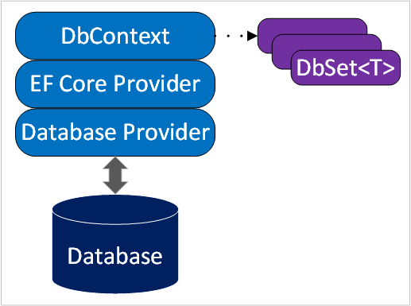

# Entity Framework Core (EF Core) Essentials

[Link for documentation](https://learn.microsoft.com/en-us/training/modules/persist-data-ef-core/2-understanding-ef-core)

## DbContext
- Represents a session with the database.
- Configures options, connection strings, logging, and data model.
- Saves and queries entity instances.
- Contains `DbSet<T>` properties (representing database tables).

## Key Components
1. **DbContext Derivatives**:
   - Active database session.
   - Entity saving and querying.
   - `DbSet<T>` properties for tables.

2. **EF Core Provider**:
   - Translates object changes to SQL.
   - Database-specific plugin.
   - Handles native SQL dialect.
   - Enables unique database features.

## Database Schema Management
Two primary approaches:
1. **Migrations** (Model-first)
2. **Reverse Engineering** (Database-first)

### Migrations
- Incremental schema updates.
- Sync database with data model.
- Developer-driven process:
  1. Introduce model changes.
  2. Generate migration (using EF Core tools).
  3. Review/modify generated C# code.
  4. Apply migration to the database.
- Tracks applied migrations in a history table.

### Reverse Engineering
- Generate model from existing database.
- Useful for legacy databases.

## Architecture Diagram
